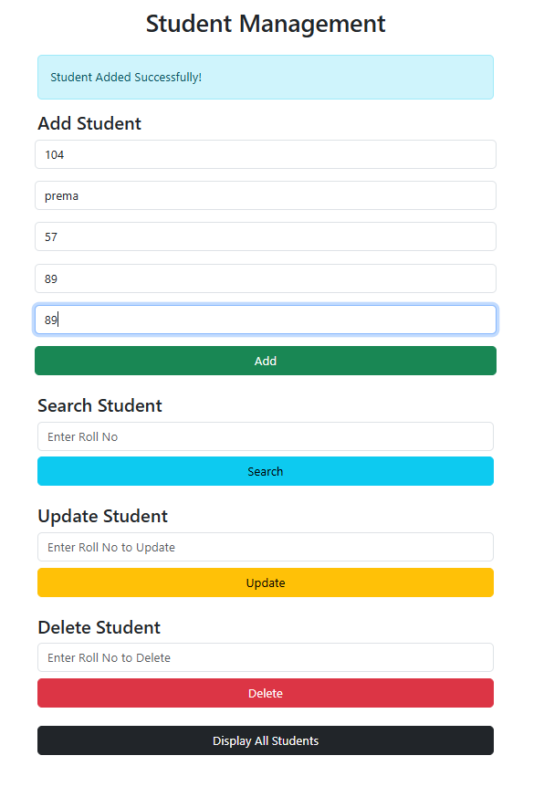
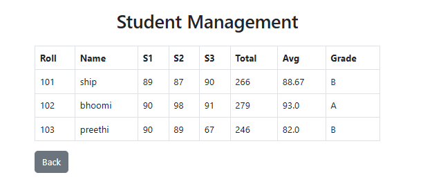

🎓 Student Management System - Flask

A simple web-based application built with Flask and SQLite to manage student records.

🚀 Features

✅ Add Student Details (Name, Roll No, Subject Marks)  
✅ Calculate Total, Average, and Grade  
✅ Store data in SQLite Database  
✅ Search Student by Roll Number  
✅ Update Student Record  
✅ Delete Student Record  
✅ Display All Students in Table

🛠️ Technologies Used

🐍 Python

🗃️ SQLite

🌐 HTML5 & CSS (Bootstrap)

🧩 Jinja2 (Flask Templating)

🖥 Screenshots

